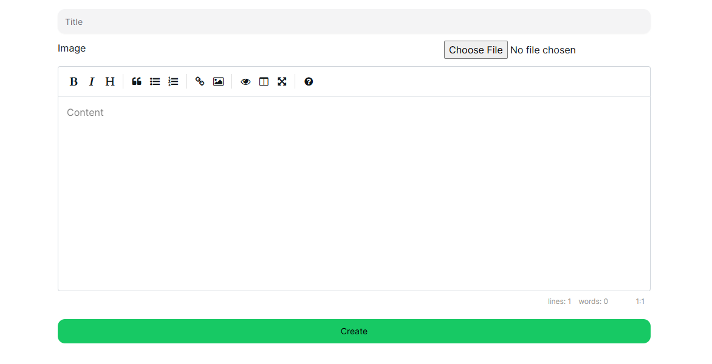
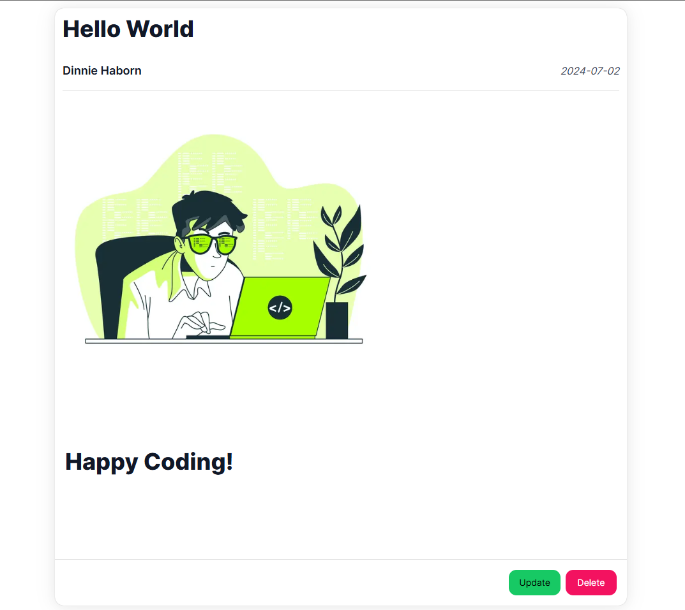
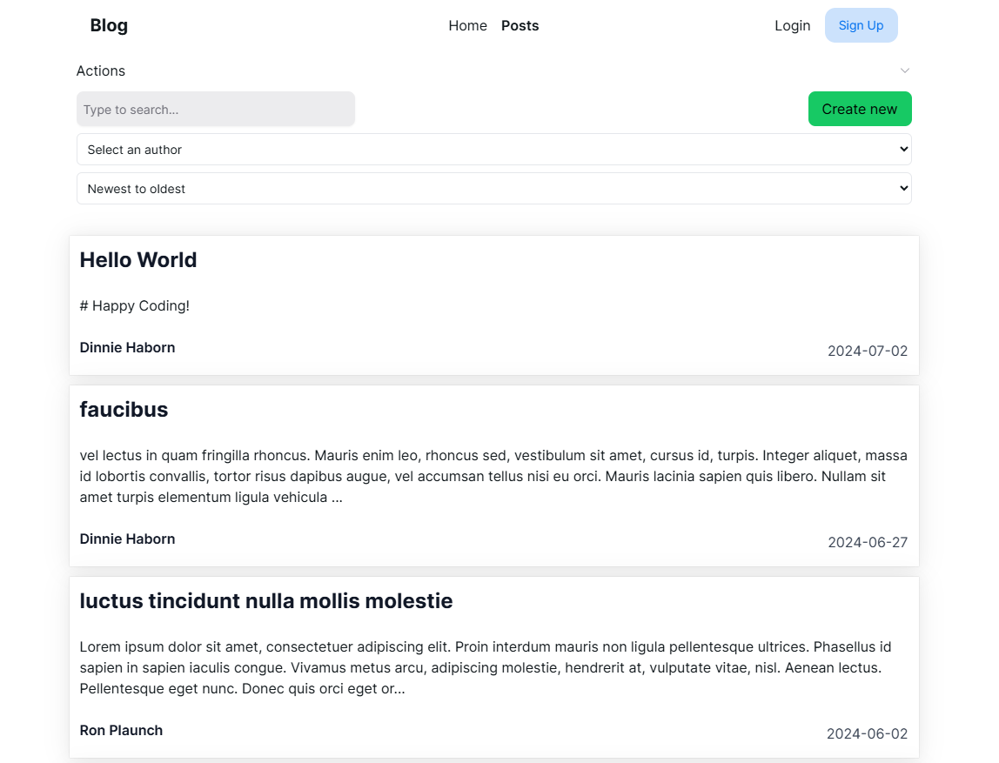

# Next Blog

This project uses Next.js 14 to create a simple but powerful blog app. It uses Next UI components along with TailwindCSS, as well as Prisma with MySQL.

## Features

- Create post
- Edit post
- Retrieve single post
- Get all posts
- Modern editor
- Image upload
- Order, filter and pagination

## Design

### Form Validation

The forms (create and edit posts) are client components with `fetch` to route handlers to:

1. better interact with the form fields
2. provide modern editor
3. have more control over the form

They are validated with `zod` and controlled with `react-hook-form`.

### Delete Post

The post deletion process uses a server action to trigger the sql (prisma) command to directly delete the post. The `server actions` are preferred here because it is a simple process and there are not many UI interactions.

### Posts Retrieve

The posts page is a dynamic server side rendered page that fetches the posts and other related data and passes them to its children, like: actions bar, posts list, and pagination components.

It uses `export const dynamic = "force-dynamic"` to reflect the latest changes in the posts.

### Actions

Actions are changing the order direction, filter by users, and pagination. They update the search params when changed, therefore, the posts page detects the changes and refetch the necessary data.

## Contributions

The project is very capable and designed to be scalable, it still lacks many features like user authentication, login, register, filter by other fields, search for posts. Contributions are welcomed for people who want to practice and improve the project.
